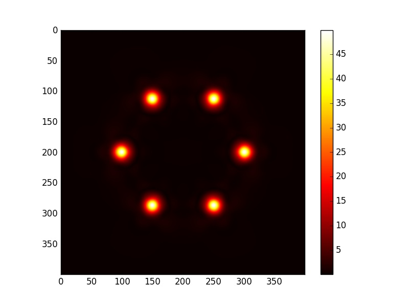
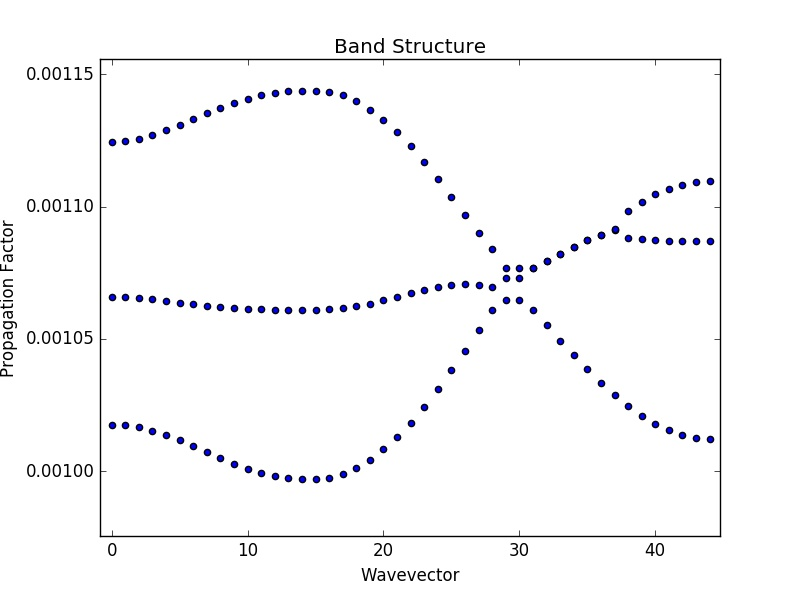

# Beam
> Beam Propagation Simulator

## Features
+ Finite-Difference Time-Domain Method (Debuging)
+ Custom Index Distribution
+ Bulk/Edge Bandstructure Supported (Developing and debuging)

## Examples
+ Field Calculation

+ Bandstructure Analysis (Not final version)

## Status
Working on it

## E-mail
longyang_123@yeah.net  
You're most welcome to contact with me to discuss the details about this project